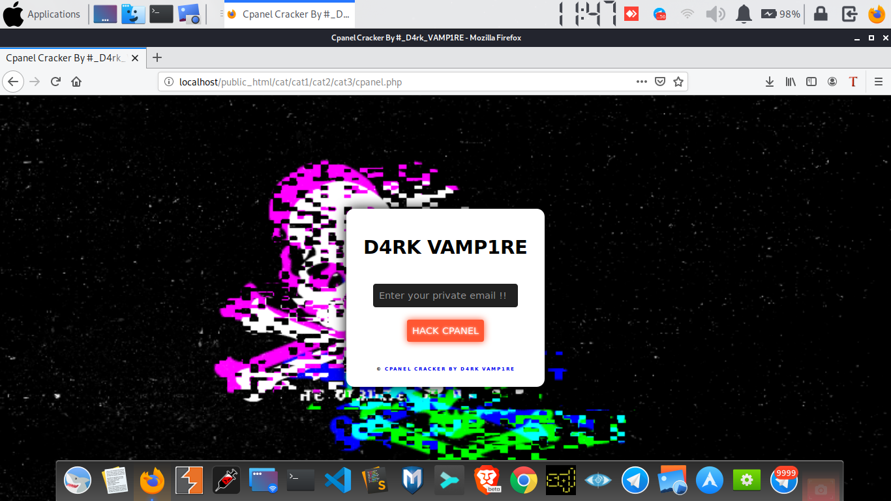

<center>
	<a href="https://instagram.com/d4rk_vamp1re.py"></a>

   <h1 align="center"> CPanel Cracker </h1>
</center>

The CPanel Cracker is a php script which allows the attacker to reset cpanel and get access into it. The script must have to be uploaded in the target server by tempering the request and exploiting file upload vulnerbility or exploiting RCE vulnerbility.

### Requirements

What things you need to use the script

```
The CPanel must have reset password option.
```

### How To Use

A step by step guide to script


```
$ git clone https://github.com/D4rk-VAMP1RE/CPanel_Cracker
```


```
$ Upload the cpanel.php file in the target server.
```

```
$ Now open the cpanel.php file in the new tab after uploading it.
```

```
$ A dialog box will appear asking for your email address just put it and hit enter.
```

```
$ You will be redirected to the Cpanel of the site. Now put your mail there and continue.
```

```
$ Now you will recieve a email for reseting the cpanel password. It's Done Enjoy.
```


Thank you have a nice day.

## Support us :
* [Contact us in Telegram](https://t.me/base64_encrypted)
* [Follow us in Instagram](https://instagram.com/d4rk_vamp1re.py)
* [Follow us in Twitter](https://twitter.com/D4rk_VAMP1RE)

<center>
<h1>JAI HIND :!</h1>
<center>
